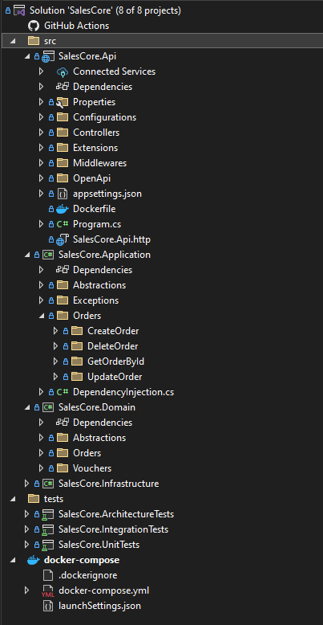
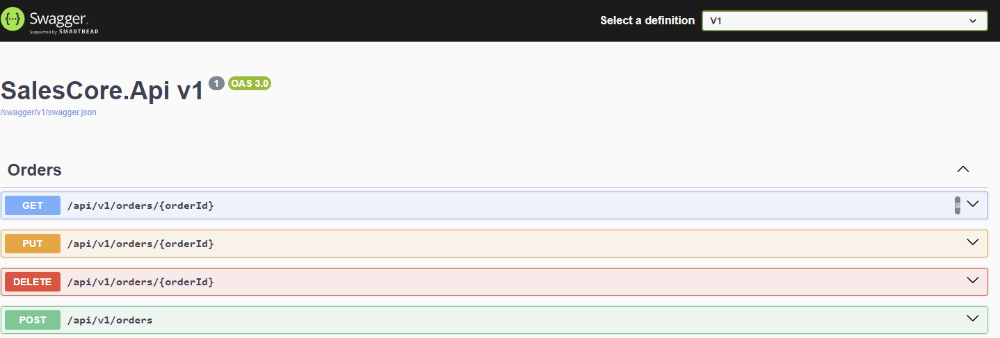

# SalesCore API

## Overview

The **SalesCore API** is a prototype for managing sales within the **Sales domain** of **123Vendas**, built using **.NET Core 8** and **Postgres**. It provides a complete **CRUD** for sales records, including details like sale number, date, customer, total value, products, discounts, and sale status (Cancelled/Not Cancelled).

### Project Structure


### Swagger UI
Below is a preview of the Swagger UI used for interacting with the API:



### Features
- **CRUD operations** for sales.
- Planned events for `CompraCriada`, `CompraAlterada`, `CompraCancelada`, and `ItemCancelado` (not yet implemented).

### Tech Stack
- **.NET Core 8**
- **Postgres**
- **Docker** (for containerization)
- **Serilog** (for logging)
- **Husky** (for semantic commits)
- **MediatR** (for CQRS pattern)
- **CQRS** (Command Query Responsibility Segregation)
- **DDD** (Domain-Driven Design)
- **RESTful APIs**
- **Clean Code** principles
- **SOLID** principles

### Testing
- **XUnit**
- **FluentAssertions**
- **Bogus** (for test data generation)
- **NSubstitute** (for mocking)
- **TestContainers** (for integration tests with containerized dependencies)

### TODO
- Implement domain events.
- Implement the **Outbox Pattern**.
- Add resilience to domain events using **Polly**.
- Implement idempotency in the domain event handlers to avoid processing the same event more than once (using decorators).
- Others.

### How to Run
1. Clone the repository:
   ```bash
   git clone https://github.com/ezequielcsilva/SalesCore.git

2. Navigate to the project directory:
   ```bash
   cd SalesCore.Api

3. Build and run using Docker:
   ```bash
   docker-compose up --build
